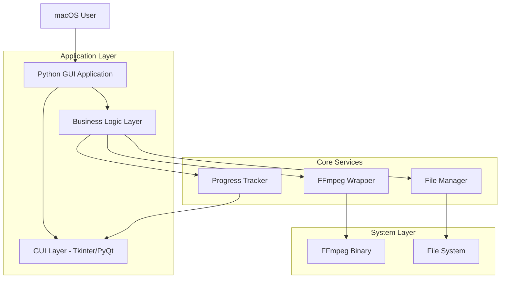

## 1. アーキテクチャ設計



## 2. 技術仕様

- **フロントエンド**: Python 3.11+ + Tkinter/PyQt6
- **メディア処理**: FFmpeg 5.x+（外部バイナリ）
- **パッケージング**: PyInstaller 5.x+
- **依存関係管理**: pip + requirements.txt
- **ビルドツール**: setuptools

## 3. モジュール構成

### 3.1 メインモジュール

| モジュール名 | 責務 |
|-------------|-------------|
| `main.py` | アプリケーションエントリーポイント、GUI初期化 |
| `gui/` | ユーザーインターフェース関連モジュール |
| `converter/` | メディア変換ロジック |
| `utils/` | ユーティリティ関数群 |
| `config/` | 設定管理 |

### 3.2 コアクラス

```python
# メインウィンドウクラス
class MainWindow(QMainWindow):
    def __init__(self):
        # GUI初期化、イベントハンドラー設定
        
    def setup_ui(self):
        # UIコンポーネント配置
        
    def handle_drop_event(self, event):
        # ドラッグ＆ドロップ処理
        
    def start_conversion(self):
        # 変換プロセス開始

# 変換マネージャー
class ConversionManager:
    def __init__(self):
        # FFmpegパス設定、スレッドプール初期化
        
    def convert_file(self, input_path, output_path):
        # 個別ファイル変換実行
        
    def convert_batch(self, file_list, output_dir):
        # 複数ファイル一括変換
        
    def get_progress(self):
        # 進捗情報取得

# ファイルマネージャー
class FileManager:
    def select_output_directory(self):
        # 出力ディレクトリ選択ダイアログ
        
    def validate_input_files(self, file_paths):
        # 入力ファイル検証
        
    def generate_output_filename(self, input_path):
        # 出力ファイル名生成
```

## 4. 外部依存関係

### 4.1 Pythonパッケージ

```txt
# requirements.txt
PyQt6==6.5.0  # または tkinter（標準ライブラリ）
ffmpeg-python==0.2.0
pathlib==1.0.1
threading（標準ライブラリ）
os（標準ライブラリ）
sys（標準ライブラリ）
```

### 4.2 システム依存関係

- **FFmpeg**: `/usr/local/bin/ffmpeg` またはバンドル化
- **macOS**: 10.14 (Mojave) 以降
- **Python**: 3.8 以降

## 5. ビルド設定

### 5.1 PyInstaller設定

```spec
# mp4_to_mp3_converter.spec
a = Analysis(
    ['main.py'],
    binaries=[('ffmpeg', 'ffmpeg')],  # FFmpegバイナリを含める
    datas=[('icons', 'icons')],       # アイコンファイル
    hiddenimports=['PyQt6', 'ffmpeg'],
    ...
)

# macOS用設定
app = BUNDLE(
    exe,
    name='MP4toMP3Converter.app',
    icon='icons/app.icns',
    bundle_identifier='com.yourcompany.mp4tomp3converter',
    info_plist={
        'CFBundleName': 'MP4 to MP3 Converter',
        'CFBundleShortVersionString': '1.0.0',
        'NSHighResolutionCapable': 'True',
    }
)
```

### 5.2 インストーラー設定

```bash
# build.sh
#!/bin/bash
python -m PyInstaller mp4_to_mp3_converter.spec --clean

# コード署名（オプション）
codesign --deep --force --verify --verbose \
    --sign "Developer ID Application: Your Name" \
    "dist/MP4toMP3Converter.app"

# ディスクイメージ作成
hdiutil create -volname "MP4 to MP3 Converter" \
    -srcfolder dist/MP4toMP3Converter.app \
    -ov -format UDZO \
    "MP4toMP3Converter.dmg"
```

## 6. エラーハンドリング

### 6.1 例外クラス

```python
class ConversionError(Exception):
    """変換処理に関するエラー"""
    pass

class FileValidationError(Exception):
    """ファイル検証エラー"""
    pass

class FFmpegNotFoundError(Exception):
    """FFmpegが見つからないエラー"""
    pass
```

### 6.2 エラーメッセージ

| エラー種別 | ユーザーメッセージ | ログレベル |
|------------|-------------------|------------|
| ファイル形式エラー | 「MP4形式のファイルを選択してください」 | WARNING |
| FFmpeg未検出 | 「FFmpegがインストールされていません」 | ERROR |
| 変換失敗 | 「変換中にエラーが発生しました」 | ERROR |
| ディスク容量不足 | 「保存先に十分な空き容量がありません」 | WARNING |

## 7. パフォーマンス最適化

### 7.1 マルチスレッド処理

```python
class ThreadPool:
    def __init__(self, max_workers=None):
        self.executor = ThreadPoolExecutor(max_workers=max_workers)
        
    def submit_conversion(self, task):
        # 非同期変換タスクの実行
        
    def shutdown(self):
        # グレースフルシャットダウン
```

### 7.2 メモリ管理

- 大きなファイルはストリーミング処理
- 進捗情報の定期的な更新（100ms間隔）
- 完了したタスクのメモリ解放

## 8. テスト戦略

### 8.1 単体テスト

```python
# test_converter.py
def test_file_validation():
    # 各種ファイル形式の検証
    
def test_ffmpeg_wrapper():
    # FFmpegコマンド生成テスト
    
def test_progress_calculation():
    # 進捗計算の正確性テスト
```

### 8.2 統合テスト

- 各種MP4形式（H.264, H.265, MPEG-4）
- 特殊文字を含むファイル名
- 大容量ファイル（1GB以上）
- 複数ファイル同時変換（10個以上）